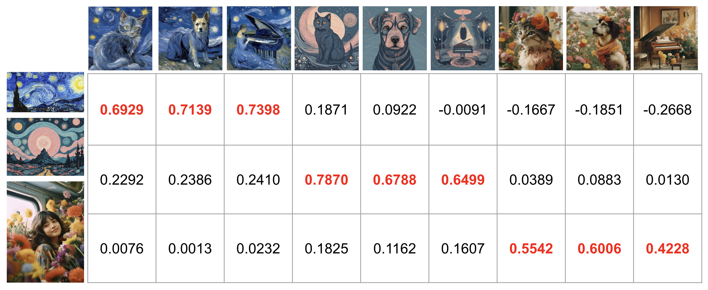

# CSD-Score

This project employs [CSD](https://github.com/learn2phoenix/CSD) to computer style similarity between images.



The images are generated via [InstantStyle](https://huggingface.co/spaces/InstantX/InstantStyle).

## Download
Download the [CLIP model](https://openaipublic.azureedge.net/clip/models/b8cca3fd41ae0c99ba7e8951adf17d267cdb84cd88be6f7c2e0eca1737a03836/ViT-L-14.pt) and [CSD model](https://drive.google.com/file/d/1FX0xs8p-C7Ob-h5Y4cUhTeOepHzXv_46/view?usp=sharing) and save them under `./models`.

## Prepare
```bash
pip install git+https://github.com/openai/CLIP.git
pip install timm==0.6.12
```

## Usage

```bash
import torch
import torch.nn as nn
from torchvision import transforms
import torchvision.transforms.functional as F

from model import CSD_CLIP, convert_state_dict

from PIL import Image

# init model
model = CSD_CLIP("vit_large", "default")

# load model
model_path = "models/checkpoint.pth"
checkpoint = torch.load(model_path, map_location="cpu")
state_dict = convert_state_dict(checkpoint['model_state_dict'])
model.load_state_dict(state_dict, strict=False)
model = model.cuda()

# normalization
normalize = transforms.Normalize((0.48145466, 0.4578275, 0.40821073), (0.26862954, 0.26130258, 0.27577711))
preprocess = transforms.Compose([
                transforms.Resize(size=224, interpolation=F.InterpolationMode.BICUBIC),
                transforms.CenterCrop(224),
                transforms.ToTensor(),
                normalize,
            ])

# style image
image = preprocess(Image.open("examples/10.jpg")).unsqueeze(0).to("cuda")
_, content_output, style_output = model(image)

# another style image
image1 = preprocess(Image.open("examples/11.png")).unsqueeze(0).to("cuda")
_, content_output1, style_output1 = model(image1)

sim = style_output@style_output1.T
print(sim)
```
